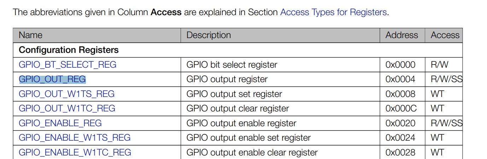

# Thanks "The EV Engineer" for video

The GPIO driver is often considered the 'Hello World' program in the world of embedded drivers.

Steps:
1. Find Address Mapping, here you can get starting memory address 
2. Then go to GPIO Matrix Register Summary, address in this table it like offset 
3. To use pin as GPIO, have to set up register IO_MUX_GPIO5_REG as GPIO mode (set up 12th bit to 1), starting memory address in the same place like step 1. 
---
- Video link: https://www.youtube.com/watch?v=QrJf6CF_g_8
- ESP-32C3 Hardware Reference https://docs.espressif.com/projects/esp-idf/en/latest/esp32c3/hw-reference/index.html
